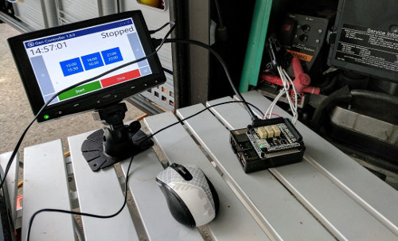

# Gen Controller

This project is a fully-programmable custom Auto-Generator Start (AGS) for Onan Generators.

# The Idea

In the summer of 2017, my family travelled around the West Coast in our 32-foot motorhome. One of the great advantages of motorhome travel is that you bring with you all the comforts of home wherever you go, no matter how rustic the surroundings. One of these travelling comforts, the one most germane to this discussion, is electricity. Typically, we will stay in a park or campground with power hookups where you simply plug the motorhome into the giant plug, and use all the electricity you like. 

Sometimes, you'll want to stay somewhere without a convenient power hookup. For these times, the coach comes with a built-in generator capable of providing all the needed power. The downside to this is that the generator makes some noise, leading to restrictions on its use in many organized campgrounds. 

The extreme example is Yosemite NP. The park has no hookups, and restricts generator hours as follows: 7am-9am, 12pm-2pm, and 5pm-7pm. Ideally, we would like to run our generator at all those times, storing all the power we can in our batteries for use at other times of day. However, we are not going to always be around our site at exactly those times. This leaves us with the problem of either restricting our time out enjoying the park, or accepting less electricity use.

This seems like a great problem to solve with technology. We need a system that will automatically turn the generator on and off at precisely the prescribed times of day, whether or not we are around. This way, we can enjoy the park to the fullest and maximize our power generation. Technology FTW!

# Hardware 

* [Raspberry Pi](https://www.adafruit.com/category/105)
* [DS3231 Real-time clock module](https://www.adafruit.com/product/3013)
* [Pimoroni Automation Hat](https://www.adafruit.com/product/3289)
* [Onan remote control harness](https://www.rvupgradestore.com/Onan-Remote-Control-Panels-Wiring-Harness-p/55-8685.htm)

# Software Environment

* [Windows 10 IoT Core](https://developer.microsoft.com/en-us/windows/iot)

Perhaps my favorite thing about Windows IoT Core is how little effort is required to have a native version. One of my first rules of embedded development is to have a native version of the system, enabling much faster turns of the coding loop. Here, it's as simple as changing the compiler target to x86, and making sure any hardware-specific code is hidden behind a service locator. This means I can ensure all the logic is working right, quickly debugging if needed, without having to wait for a (slow) deployment to target hardware. Likewise, I can test the business logic in .NET unit tests on the host PC--again much faster than deploying tests and running on the target.

# Software Components

The project is comprised of these pieces:

* [GenController.Uwp](./GenController.Uwp) Universal Windows App, contains the UI screens and Windows-specific components.
* [GenController.Portable](./GenController.Portable) .NET Standard library, contains the platform-independent application logic, viewmodels.
* [GenController.Portable.Tests](./GenController.Portable.Tests) Unit tests for the application logic.
* [Commonality](./Commonality) .NET Standard library, contains domain-independent helper classes.

# Dependencies

The project consumes these dependencies:

* [IoTFrosting](https://github.com/jcoliz/Iot-Frosting): For control of the Pimoroni Automation Hat and the DS3231 real-time clock.
* [Catnap.Server](https://github.com/jcoliz/Catnap.Server): To present a web backend